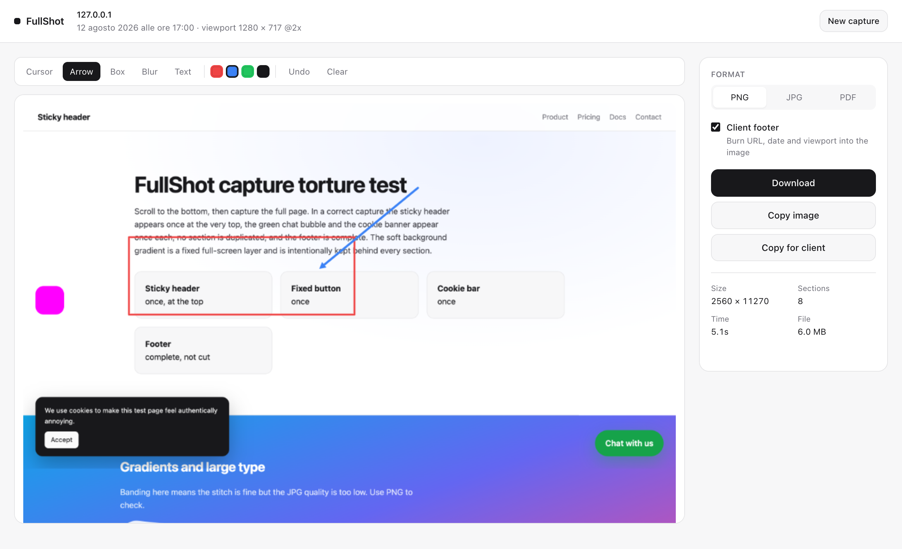
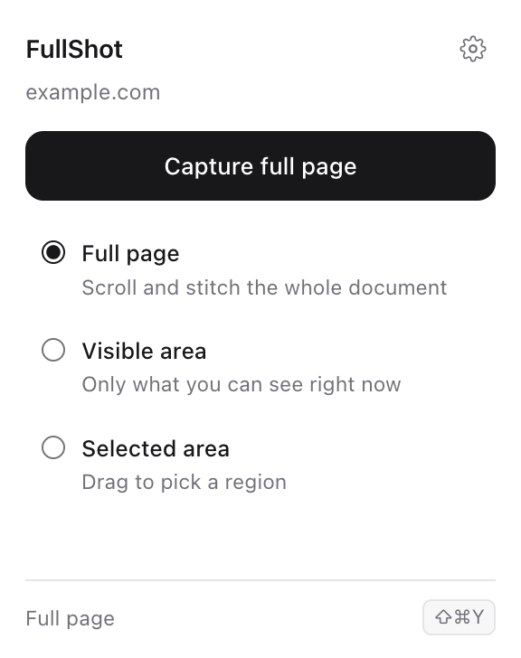
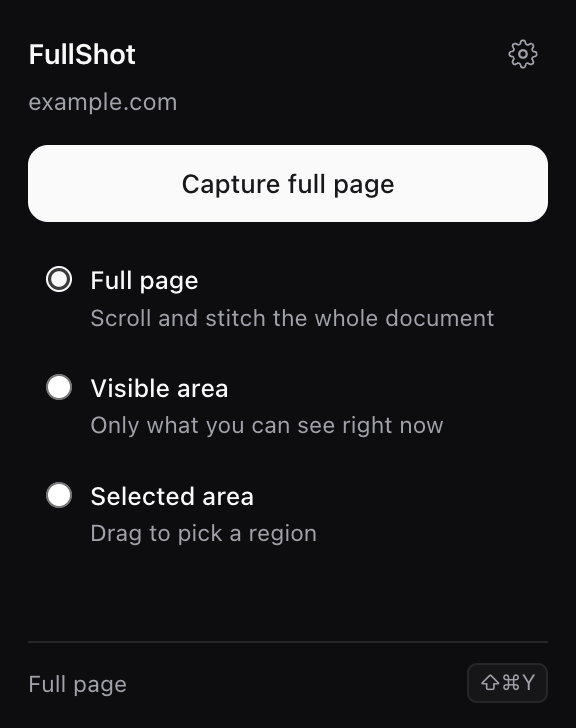
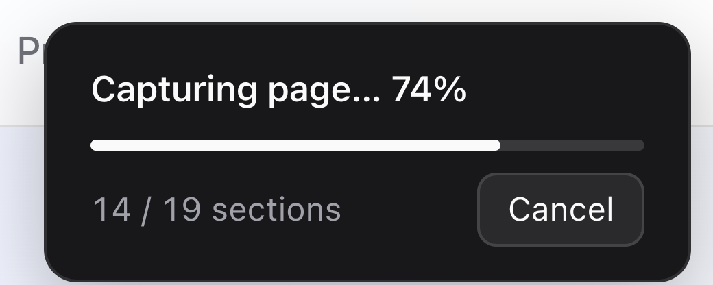
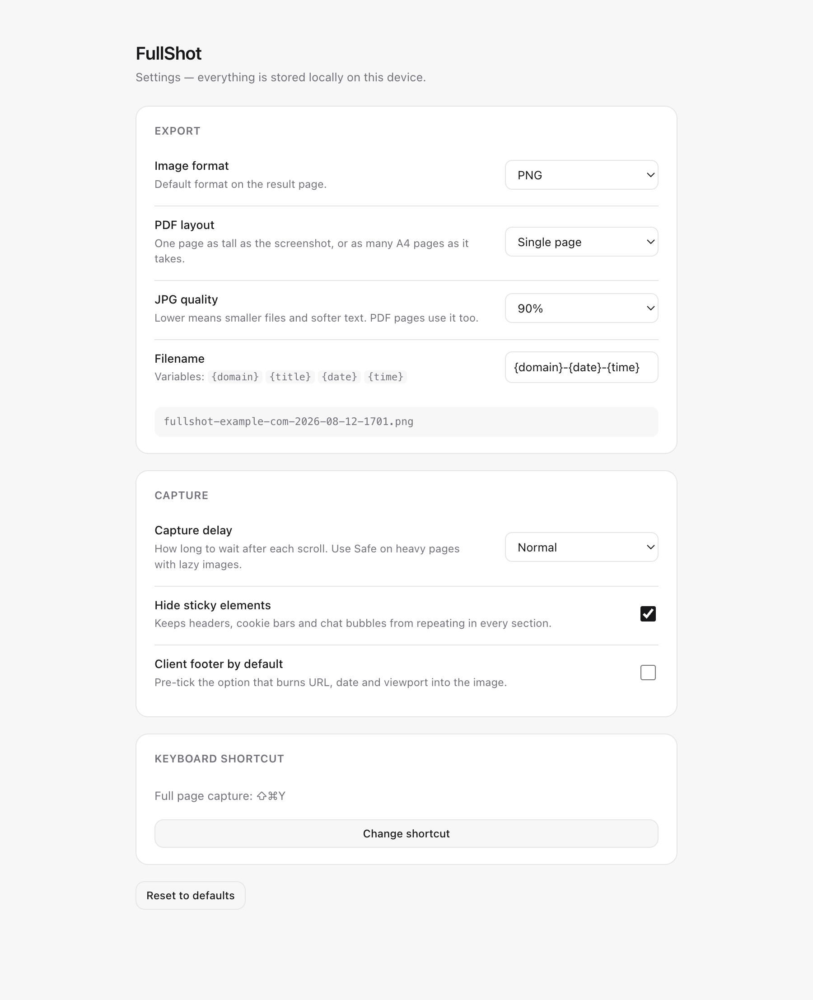

# FullShot

Full-page screenshots for Chrome. Scrolls the page, captures every section,
stitches them into one image, and lets you annotate and export it — entirely on
your machine. No account, no server, no upload, no analytics.

Manifest V3, plain ES2022, zero dependencies, no remote code.



<table>
  <tr>
    <td width="34%"></td>
    <td width="34%"></td>
    <td width="32%" valign="top">
      <br><br>
      Light and dark follow the system. The progress panel lives in a Shadow DOM
      on the page, shows real progress, and hides itself for the instant each
      section is taken so it never lands in the screenshot.
    </td>
  </tr>
</table>



*Every screenshot above was produced by the extension running in Chrome:
`node test/screenshots.mjs` regenerates all of them.*

---

## Install locally

1. Open `chrome://extensions`
2. Turn on **Developer mode** (top right)
3. Click **Load unpacked**
4. Select this folder

The FullShot icon appears in the toolbar. Pin it for quick access.

To capture local `file://` pages, also tick **Allow access to file URLs** on
FullShot's card in `chrome://extensions`.

---

## Using it

Click the icon, pick a mode, press the button.

| Mode | What it does |
|---|---|
| **Full page** | Scrolls the whole document and stitches every section |
| **Visible area** | Captures exactly what is on screen |
| **Selected area** | Drag a rectangle inside the viewport |

**Keyboard shortcut:** `⌘⇧Y` (macOS) / `Ctrl+Shift+Y` (Windows, Linux) starts a
full page capture. A second command, *Capture the visible area*, ships without a
default binding — Chrome only pre-assigns four shortcuts per extension, and two
is enough. Assign it (or change the first) in `chrome://extensions/shortcuts`.

While capturing, a small panel in the top right shows real progress and a
**Cancel** button. `Esc` cancels too. The panel is hidden for the instant each
screenshot is taken, so it never appears in the image.

When the capture ends, a result tab opens with the preview, the annotation
tools, and the export panel.

### Annotation

Arrow, box, blur and text, in four colours. `Ctrl/⌘+Z` undoes. Annotations are
stored as geometry in image coordinates, so the preview and the exported file
render identically — nothing is baked in until you export.

Blur samples the underlying pixels through a canvas filter, so it genuinely
destroys the content in the exported image. It is not a black box drawn on top.

### Copy for client

One button that produces a screenshot with a metadata strip burnt into the
bottom: **URL, date and time, and the viewport it was captured at**. The
clipboard gets both the image *and* the same details as plain text, so pasting
into Slack or an email gives the picture, and pasting into a text field gives
the context.

The strip can also be enabled for normal downloads (the *Client footer*
checkbox, or *Client footer by default* in Settings).

### Export

- **PNG** — lossless, the default
- **JPG** — 70 / 80 / 90 / 100%
- **PDF** — one page as tall as the screenshot, or as many A4 pages as it takes
- **Copy image** — PNG to the clipboard
- **Download** — through `chrome.downloads`, named from your template

PDF pages embed JPEG at the quality you pick, which is why the quality selector
stays on screen for PDF. A screenshot PDF is one image per page and nothing
else, so `result/pdf.js` writes those few dozen lines of PDF syntax directly
rather than pulling in a ~300 KB PDF library that this extension would then have
to vendor and justify.

Filename template variables: `{domain}`, `{title}`, `{date}`, `{time}`.
Default `{domain}-{date}-{time}` produces `fullshot-example-com-2026-08-11-1632.png`.
Domain and title are sanitised (accents folded, punctuation collapsed, lower
case, length capped) so the name is always a valid file name.

---

## Architecture

```
popup / keyboard command
        │  CAPTURE_START
        ▼
background/service-worker.js ──── injects ───▶ content/*.js
        │                                          │
        │  ◀───────── CAPTURE_TILE ────────────────┤   (one per section)
        │  captureVisibleTab → ImageBitmap         │
        │  → draw on one OffscreenCanvas           │
        │                                          │
        │  ◀───────── CAPTURE_FINISH ──────────────┘
        │  canvas → PNG Blob → IndexedDB
        ▼
result/result.html?id=…  →  preview, annotate, export
```

Three decisions shape everything else:

**The page owns the algorithm, the worker owns the pixels.** The content script
scrolls, measures and computes the exact crop of every tile; the worker only
screenshots the viewport and paints the rectangle it is told to paint. All the
tricky geometry lives in one file with one source of truth for the scroll
position.

**No offscreen document.** A service worker can already do `createImageBitmap`
and `OffscreenCanvas`, which is the only reason the offscreen API is usually
needed here. Dropping it removes a permission, a document, and a message hop.

**IndexedDB for the handoff, not messages.** The finished image is several
megabytes. `chrome.runtime` messages are JSON, so passing it that way means
base64 (+33%) through a single channel; `chrome.storage` stores strings and has
a quota. IndexedDB stores the `Blob` natively and both contexts can reach it.

### Files

```
manifest.json
background/service-worker.js   orchestration, capture, compositing, downloads
content/page-utils.js          scroller detection, metrics, settle, lazy media
content/fixed-elements.js      find / neutralise / restore fixed and sticky nodes
content/progress-ui.js         Shadow DOM progress panel with cancel
content/select-area.js         drag-to-select overlay
content/capture.js             the capture loop (the algorithm)
popup/                         popup UI
result/result.js               preview, export, clipboard, downloads
result/annotate.js             annotation model, renderer, client footer
result/pdf.js                  minimal PDF writer (single page and A4)
settings/                      options page
shared/constants.js            message types, limits, defaults, DEBUG flag
shared/utils.js                filenames, formatting, tab validation, canvas clamp
shared/storage.js              settings in chrome.storage.local
shared/db.js                   IndexedDB handoff + pruning
shared/theme.css               design tokens, light and dark
test/test-page.html            hostile page: sticky header, fixed widgets, lazy media
test/stitch-probe.html         machine-verifiable page for the geometry test
test/unit.mjs                  self-check for the pure helpers (no browser)
test/harness.mjs               shared Chrome + DevTools-protocol plumbing
test/e2e-stitch.mjs            geometry, result page, annotation, export
test/e2e-fixed.mjs             sticky and fixed elements on the hostile page
test/screenshots.mjs           regenerates the README screenshots
assets/screenshots/            those screenshots
assets/icons/icon.svg          master artwork; the PNGs are rasterised from it
```

---

## How the algorithm works

### The one rule

Everything follows from a single cumulative cursor, `paintedTo`, in CSS pixels
from the top of the document:

```
scroll to paintedTo
read the scroll position the browser actually reached
crop away whatever is already painted
paint the rest
```

```js
const actualTop = metrics.scrollTop;              // may be less than requested
const cropTop   = Math.max(0, paintedTo - actualTop);
const destY     = Math.max(paintedTo, actualTop);
const height    = Math.min(viewportHeight - cropTop, canvasHeight - destY);
paintedTo       = destY + height;
```

This replaces the special cases people normally hand-write:

- **The last viewport.** Near the bottom the browser clamps the scroll, so the
  final screenshot overlaps the previous one. `cropTop` absorbs exactly that
  overlap, so the tail is never duplicated. There is no separate "last tile"
  branch: with `documentHeight = 3400` and `viewportHeight = 1000` the positions
  are `0, 1000, 2000, 2400`, and the fourth tile contributes only its bottom
  400 px.
- **Pages shorter than one viewport**, which finish in a single tile.
- **Pages that grow while scrolling.** The canvas is sized once, from the height
  the document had when the capture started; anything appended later is out of
  scope, which is also what stops the loop from running forever.
- **Scroll anchoring or overshoot**, handled by `destY`.

### Device pixel ratio, zoom, Retina

`devicePixelRatio` is read for reporting only, never for maths. The real scale
comes from the screenshot itself:

```js
scaleX = screenshot.width  / window.innerWidth;
scaleY = screenshot.height / window.innerHeight;
```

That stays correct on Retina, on Windows display scaling, under browser zoom,
and when Chrome rounds the capture size — cases where assuming
`1 CSS pixel = 1 image pixel × dpr` produces a slightly stretched or offset
stitch.

The canvas is `documentElement.clientWidth × scaleX` wide, not `innerWidth`, so
a classic (non-overlay) scrollbar gutter is cropped out.

### Scrolling

Every scroll uses `behavior: 'instant'`, never `'auto'` and never a plain
`scrollTop = n`. This is not politeness: a great many sites set
`scroll-behavior: smooth` on `<html>` (MDN and most documentation themes do),
CSS wins over both alternatives, and every tile would then be captured part-way
through an animation. On the probe page, the difference is 4 910 correctly
aligned rows versus 561.

### The tab has to stay in front

`captureVisibleTab` photographs whichever tab is active in the window, not the
tab that asked. Every tile therefore checks first that the session's tab is
still the frontmost one, and the capture stops with a plain message if it is
not. Without that check, switching tab mid-run would stitch pixels from a page
the extension was never granted into the image, with nothing in the result to
say so. Switching to another *window* is fine: the tab is still frontmost in
its own window, which is what the API reads.

### Fixed and sticky elements

A sticky header sits still while the page scrolls under it, so a naive capture
shows it in every section.

1. Before scrolling, collect every element whose computed `position` is `fixed`
   or `sticky`, saving each one's inline `cssText`. The scan walks the document,
   **every open shadow root**, and same-origin iframe documents — third-party
   widgets (accessibility toolbars, chat bubbles, consent bars) are routinely
   rendered inside a shadow root precisely so the host page's CSS cannot reach
   them, and `querySelectorAll` does not cross that boundary.
2. Capture the **first** tile untouched, so the header appears exactly once,
   where it belongs.
3. From the second tile on: `fixed` → `visibility: hidden`, `sticky` →
   `position: static`. `visibility` is used rather than `display` because it
   does not reflow the page and invalidate the measurements.
4. Restore the exact original inline styles in a `finally` — on success, on
   error, and on cancel.

One deliberate exception: a fixed element covering ≥85% of the viewport is a
background layer, not a widget. Hiding it would leave white bands, so it is left
alone and repeats behind every section, which is what it is supposed to do.

### Lazy loading

Before each screenshot the loop waits for two animation frames plus a
configurable delay (Fast 120 ms / Normal 250 ms / Safe 550 ms), and on the first
tile it flips in-viewport `loading="lazy"` images to eager and awaits their
`decode()` with a 400 ms cap. The `requestAnimationFrame` wait has a 250 ms
timeout, because rAF stops firing entirely while a window is occluded and
without it the capture would hang the moment you switch app.

### Safety limits

| Limit | Value | Why |
|---|---|---|
| `MAX_CAPTURE_HEIGHT` | 60 000 px | Sanity bound on document height |
| `MAX_NUMBER_OF_CAPTURES` | 120 | Infinite scroll |
| `MAX_CAPTURE_DURATION` | 120 s | Pages that keep growing |
| `MAX_CANVAS_SIDE` / `AREA` | 16 384 / 16 384² | Chrome's real canvas ceiling |
| step timeout | 30 s | A worker torn down mid-call |

When a limit is hit the capture stops cleanly, keeps what it has, and the result
page shows a plain-language banner saying why.

### Memory

At most one `OffscreenCanvas` and one `ImageBitmap` exist at a time: each
screenshot is decoded, drawn, and `close()`d before the next scroll. Tiles are
never accumulated in an array. The canvas is zero-sized on disposal, export
canvases are released after `toBlob`, object URLs are revoked, and captures
older than 30 minutes are pruned from IndexedDB on every new run.

---

## Permissions

| Permission | Why it is needed |
|---|---|
| `activeTab` | Read the current tab and call `captureVisibleTab` — only on the tab you invoked FullShot on, only after you clicked. This is what replaces a global host permission. |
| `scripting` | Inject the capture scripts into that tab on demand. Nothing is injected until you ask for a capture. |
| `downloads` | Save the exported file. |
| `storage` | Keep your settings (`chrome.storage.local`). |

There is **no** `host_permissions`, no `tabs`, no `offscreen`, and no
`<all_urls>`. FullShot cannot see any page until you press the button on it.

### Privacy

Screenshots are composed in the service worker, stored in the browser's own
IndexedDB, and rendered in an extension page. Nothing is ever sent anywhere.
There is no network code in this extension: no `fetch` to any host, no
analytics, no CDN, no remote script. The strict MV3 CSP is not relaxed.

---

## Known limitations

- **`chrome://` pages, the Chrome Web Store, and other extensions' pages**
  cannot be captured — Chrome blocks all extensions there.
- **PDFs opened in Chrome's viewer** cannot be captured; use the browser's own
  print-to-PDF.
- **Cross-origin iframes** are captured as rendered pixels (which is usually
  what you want), but their internal scroll is not, and a fixed widget living
  inside one cannot be hidden. The same goes for **closed** shadow roots — open
  ones are handled. Nothing in an extension content script can reach either.
- **Scroll-driven and pinned sections** (a section that stays put while its
  content cross-fades, common in Elementor and GSAP-built pages) capture the
  animation state that existed at each scroll stop, so the stitched result can
  show a cross-fade mid-way. This is inherent to scroll-and-stitch: the states
  never coexisted on screen either. The rest of the page is unaffected.
- **Overlay scrollbars** (macOS) may appear in one section if they are visible
  at that moment. Classic scrollbar gutters are cropped away.
- **Only the document scroll** is followed. Inner scroll containers are captured
  at their current position; a page whose entire content lives in one inner
  scroller is detected and used instead.
- **Very tall pages** are cut at 16 384 device pixels — Chrome's canvas ceiling.
  On a 2× display that is about 8 000 CSS pixels. A *split screenshot* mode is
  the planned fix (see Roadmap).
- **Pages that lazily render on scroll** may need the *Safe* delay preset.
- The result page holds the image in memory; reloading that tab after 30 minutes
  will report the capture as expired.

---

## Testing

### Manual

`test/test-page.html` is built to break naive capture tools: sticky header,
fixed chat bubble, fixed cookie banner, a full-screen fixed background, lazy
images, a 2 400 px section with a ruler, scroll-revealed content, an inner
scroll container, an iframe, gradients, and a constantly running animation.

Open it from the file system (or any static server) and capture it. A correct
result has the header once at the top, the bubble and the cookie bar once each,
sequential ruler values with no repeats or gaps, and a complete footer.

Also worth a manual pass: a long WordPress or Elementor page, a product listing,
a page at 150% browser zoom, and a Retina display.

### Automated

Both suites launch real Chrome with the unpacked extension, capture a page, and
assert against the actual pixels of the stitched image.

```bash
node test/unit.mjs         # pure helpers, no browser, one second

npx @puppeteer/browsers install chrome@stable --path ~/.cache/fullshot-chrome
node test/e2e-stitch.mjs   # geometry, result page, annotation, export
node test/e2e-fixed.mjs    # sticky and fixed elements
```

Branded Google Chrome has refused `--load-extension` since version 137, so the
browser suites need Chrome for Testing. The harness finds the newest install
under `~/.cache/fullshot-chrome` or `/tmp/cft` by itself; point it elsewhere
with `CHROME=/path/to/binary`, and add `HEADED=1` to watch it work.

**`unit.mjs` — the helpers underneath.** File names, tab eligibility, the
canvas ceiling, and the validation of values read back from storage. These are
the places where a wrong answer is silent rather than visible, so they are
checked directly: that a page title of `../../../../Desktop/owned` cannot
escape the download folder, that `?file=x.pdf` on an HTML page is still
capturable, and that a format string the code does not recognise never reaches
a CSS selector or a file extension.

**`e2e-stitch.mjs` — geometry.** `test/stitch-probe.html` renders a strip in
which every row's colour encodes its own Y coordinate, so decoding that strip
out of the screenshot gives the true document offset of every row. "Did the
stitch work" becomes arithmetic.

```
PASS  full page capture completes
PASS  scroll position restored
PASS  page DOM restored
PASS  image height equals document height                    5050 vs 5050
PASS  image width equals viewport width (scrollbar cropped)  900 vs 900
PASS  more than one tile was stitched                        10 tiles
PASS  no duplicated or missing band       bands=[[0,49],[516,40],[4999,51]]
PASS  sticky header and floating widget each appear once
PASS  every other row decodes to its true document offset    4910 rows aligned
PASS  result page renders the capture
PASS  annotated JPG export downloads                         Saved · 121.9 KB
PASS  PDF export (single) downloads                          Saved · 122.7 KB
PASS  PDF export (a4) downloads                              Saved · 128.7 KB
PASS  visible area capture completes
PASS  visible capture equals one viewport                    {"h":557,"tiles":1}
PASS  switching tab mid-capture aborts the run
PASS  the aborted run leaves no session behind
```

Only three regions may legitimately fail to decode: the 50 px sticky header at
the top, the 40 px fixed widget in the first viewport, and the 50 px of page
below the probe strip. Anything else is a duplicated or missing band and fails
the run. The stitched PNG is written to `/tmp/fullshot-capture.png`, and the
annotated preview to `/tmp/fullshot-annotated.png`.

**`e2e-fixed.mjs` — sticky and fixed elements.** Captures the hostile page and
scans the composite for each piece of furniture by colour: the green chat
bubble, the dark cookie bar, the footer, the magenta widget hidden inside an
open shadow root, and dark nav text on a light row (which on that page can only
be the sticky header).

```
PASS  capture completes
PASS  scroll position restored
PASS  inline styles restored on header and floating button
PASS  image height equals document height     5635 vs 5635
PASS  several tiles stitched                  9 tiles
PASS  floating chat bubble appears once       [[581,52]]
PASS  cookie banner appears once              [[517,116]]
PASS  both sit inside the first viewport      vh=657
PASS  sticky header appears only at the top   nav-text bands at y=[[23,9]]
PASS  shadow-DOM widget appears once          [[329,56]]
PASS  footer reaches the bottom of the image
```

Each band is `[y, height]` in the stitched image. The header's nav links exist
only at y=23, the bubble only at y=581 and the cookie bar only at y=517 — all
inside the first 657 px viewport of a 5 635 px page, which is exactly what
"captured once, where it belongs" means. Three crops land in
`/tmp/fullshot-testpage-{top,mid,bottom}.png`.

Both suites copy the extension to a temp directory and patch two things there,
never in your working copy: they grant `<all_urls>` (there is no user gesture to
trigger `activeTab`) and set `DEBUG = true` (a module service worker cannot be
entered any other way, since `import()` is banned inside one).

---

## Debugging

Set `DEBUG = true` in [`shared/constants.js`](shared/constants.js) and reload
the extension. You then get, in the page console and the worker console:
document size, viewport size, devicePixelRatio, the scroll position and crop of
every tile, the tile index, the canvas dimensions and derived scale, and the
capture duration. It also exposes `fullshot.startCapture('full')` and
`fullshot.sessions` in the worker console.

Where to look:

- **Worker** — `chrome://extensions` → FullShot → *service worker*
- **Capture loop** — the DevTools console of the page being captured
- **Result page** — its own DevTools

Ship with `DEBUG = false`.

---

## Build and packaging

There is no build step. The folder you load is the folder that ships — no
bundler, no transpiler, no `node_modules`. That is deliberate: it keeps the
source reviewable and satisfies the Chrome Web Store's remote-code rules with
nothing to explain.

To produce an upload package:

```bash
cd fullshot
zip -r ../fullshot-1.0.0.zip . -x '*.DS_Store' 'test/*' '*.zip'
```

Before submitting to the Chrome Web Store:

1. Confirm `DEBUG = false`.
2. Bump `version` in `manifest.json`.
3. Exclude `test/`, as above.
4. In the listing, justify each permission with the table in this README —
   `activeTab` plus `scripting` is a straightforward story, which is exactly why
   there is no `host_permissions`.
5. Store screenshots: 1280×800 or 640×400. State plainly in the description that
   no data leaves the device.

### Icons

The master is [`assets/icons/icon.svg`](assets/icons/icon.svg); the four PNGs
the manifest declares are rasterised from it by `node test/icons.mjs`, which
also drops a contact sheet in `/tmp` showing every size on both a light and a
dark toolbar.

The mark is a page that starts at the top edge of the tile and runs off the
bottom of it — top edge present, bottom edge absent. That asymmetry is the whole
idea (there is more page than fits the frame) and is what keeps it from reading
as the usual save-a-file icon. Every shape in it is sized to survive 16 px,
which is where a toolbar icon actually lives; nothing in the artwork depends on
detail that disappears there.

### Renaming

The product name lives in `APP_NAME` in
[`shared/constants.js`](shared/constants.js) — the popup, the result page and
the settings page all read it from there. To rebrand, change that constant, the
`name` and `description` in `manifest.json`, and the `fullshot-` filename prefix
in `buildFilename` in [`shared/utils.js`](shared/utils.js).

---

## Roadmap

Deliberately left out of this version, with the ground already prepared:

- **Split screenshot** — for pages past the canvas ceiling, emit
  `website-part-01.png`, `-02`, … The capture loop already knows when it was
  clamped and reports it.
- **Editable selection** — the annotation list is plain data, so moving and
  deleting existing shapes is a UI addition, not a rewrite.
